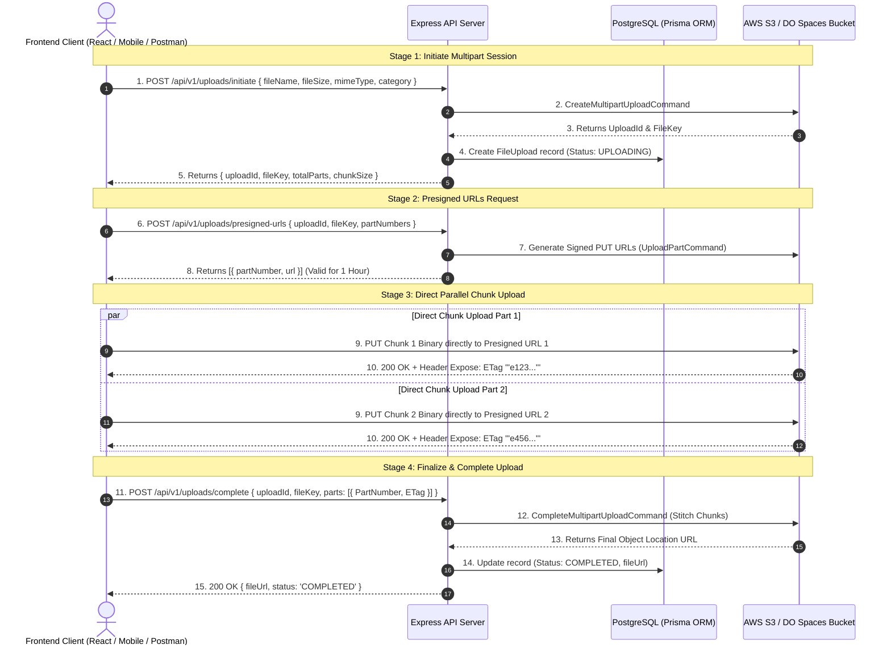

# 🚀 Direct-to-S3 Chunked Multipart Upload System

> **Enterprise-Grade Architecture for Large File & Media Uploads**  
> Built with **Node.js**, **Express**, **TypeScript**, **AWS SDK v3 (`@aws-sdk/client-s3`)**, and **Prisma ORM (PostgreSQL)**.

---

## 📌 Executive Summary

Traditional server-proxy file uploads (e.g., streaming files through Node.js via `Multer` or memory buffers) introduce severe production bottlenecks:
- **Server CPU & Memory Spikes:** Processing multi-megabyte/gigabyte streams chokes the Node.js event loop.
- **Double Bandwidth Costs:** Data travels from Client $\rightarrow$ Express Server $\rightarrow$ Cloud Storage.
- **Orphan Files:** If form validation fails after upload, files remain stranded in storage indefinitely.

This system implements a **Direct-to-S3 Chunked Multipart Upload pattern using Presigned URLs**. The Express server never touches raw file binaries; it exclusively handles cryptographically signed authorization URLs, metadata, and database state transitions.

---

## 🏗️ System Architecture & Sequence Flow



---

## 🗄️ Database Schema & Lifecycle States

The lifecycle of every file upload session is tracked in PostgreSQL via Prisma ORM:

```prisma
enum UploadStatus {
  PENDING
  UPLOADING
  COMPLETED
  FAILED
  ABORTED
}

model FileUpload {
  id          String       @id @default(uuid())
  userId      String?
  uploadId    String       @unique // S3 Multipart Upload ID
  fileKey     String       @unique // S3 Object Storage Key Path
  fileName    String
  fileSize    BigInt
  mimeType    String
  totalParts  Int
  status      UploadStatus @default(PENDING)
  fileUrl     String?
  createdAt   DateTime     @default(now())
  updatedAt   DateTime     @updatedAt

  user        User?        @relation(fields: [userId], references: [id], onDelete: SetNull)

  @@index([uploadId])
  @@index([status])
  @@map("file_uploads")
}
```

### State Transition Diagram

```
[ PENDING ] ➔ [ UPLOADING ] ┬➔ [ COMPLETED ] (Success)
                             ├➔ [ FAILED ]    (Error stitching/Parts missing)
                             └➔ [ ABORTED ]   (User cancelled)
```

---

## 🔌 API Endpoints Reference

All upload routes are mounted under `/api/v1/uploads`:

| Method | Endpoint | Description | Key Body / Query Parameters |
| :--- | :--- | :--- | :--- |
| `POST` | `/api/v1/uploads/initiate` | Initiates S3 multipart session & creates DB record | `{ fileName, fileSize, mimeType, category? }` |
| `POST` | `/api/v1/uploads/presigned-urls` | Generates 1-hour signed S3 PUT URLs for chunks | `{ uploadId, fileKey, partNumbers: [1, 2...] }` |
| `POST` | `/api/v1/uploads/complete` | Stitches uploaded parts in S3 & updates DB status | `{ uploadId, fileKey, parts: [{ PartNumber, ETag }] }` |
| `POST` | `/api/v1/uploads/abort` | Aborts S3 session & marks status as ABORTED | `{ uploadId, fileKey }` |
| `GET` | `/api/v1/uploads/status/:uploadId` | Fetches real-time status and file details | Params: `uploadId` |

---

## 🛠️ Codebase Architecture Overview

### 1. S3 SDK Connection (`src/app/libs/s3Client.ts`)
Configures the `@aws-sdk/client-s3` singleton instance using central environment variables (`region`, `endpoint`, `accessKeyId`, `secretAccessKey`).

### 2. S3 Multipart Helper (`src/app/helpers/s3Multipart.ts`)
Encapsulates AWS SDK v3 Commands:
- `CreateMultipartUploadCommand`: Initiates multipart upload session on S3.
- `UploadPartCommand` + `getSignedUrl`: Generates secure presigned URLs valid for 3600 seconds.
- `CompleteMultipartUploadCommand`: Sorts part numbers and stitches chunks on S3.
- `AbortMultipartUploadCommand`: Cancels active upload session on S3.

### 3. Business Service Layer (`src/app/modules/upload/upload.service.ts`)
- **Sanitizes Filenames:** Replaces dangerous characters with safe formatting (`/[^a-zA-Z0-9.-]/g`).
- **Dynamic File Key Pathing:** Organizes uploads into `uploads/{category}/{year}/{month}/{uuid}-{fileName}`.
- **Chunk Calculation:** Sets 10MB chunk size (exceeds S3 5MB minimum requirement).
- **Safety Guards:** Enforces 5GB maximum file size limit.
- **Ownership Verification:** Validates `userId` against database record to prevent unauthorized URL generation or completion.

---

## 🧪 Postman Step-by-Step Testing Guide

> [!TIP]
> Ensure your server is running (`npm run dev`). Base URL: `http://localhost:5000/api/v1`.

### Step 1: Initiate Upload Session
- **POST** `http://localhost:5000/api/v1/uploads/initiate`
- **Body (JSON):**
```json
{
  "fileName": "avatar.jpg",
  "fileSize": 1048576,
  "mimeType": "image/jpeg",
  "category": "avatars"
}
```
- **Copy from Response:** `uploadId` and `fileKey`.

### Step 2: Request Presigned Part URL
- **POST** `http://localhost:5000/api/v1/uploads/presigned-urls`
- **Body (JSON):**
```json
{
  "uploadId": "YOUR_UPLOAD_ID",
  "fileKey": "YOUR_FILE_KEY",
  "partNumbers": [1]
}
```
- **Copy from Response:** `url` field inside `data[0]`.

### Step 3: Direct Upload to S3
- **PUT** `YOUR_COPIED_PRESIGNED_URL`
- **Body:** Select **binary** $\rightarrow$ Choose your image file.
- **Send** request.
- **Copy from Response:** Go to **Headers** tab in Postman and copy the **`ETag`** value (e.g., `"3f5c71b693893a20146604473858066f"`).

### Step 4: Complete Upload Session
- **POST** `http://localhost:5000/api/v1/uploads/complete`
- **Body (JSON):**
```json
{
  "uploadId": "YOUR_UPLOAD_ID",
  "fileKey": "YOUR_FILE_KEY",
  "parts": [
    {
      "PartNumber": 1,
      "ETag": "\"3f5c71b693893a20146604473858066f\""
    }
  ]
}
```
- **Response:** Receives final public `fileUrl` with status `COMPLETED`.

---

## 🛡️ Production Best Practices & Security Guidelines

> [!IMPORTANT]
> **S3 / DO Spaces CORS Policy Configuration:**
> To allow browser clients to execute direct `PUT` uploads and read the `ETag` response header, apply the following CORS policy on your S3/DO Spaces bucket:
> ```json
> [
>   {
>     "AllowedOrigins": ["https://yourdomain.com"],
>     "AllowedMethods": ["GET", "PUT", "POST", "HEAD"],
>     "AllowedHeaders": ["*"],
>     "ExposeHeaders": ["ETag"]
>   }
> ]
> ```

> [!NOTE]
> **S3 Lifecycle Rules:**
> Set up an automated S3 Lifecycle Rule to abort incomplete multipart uploads after 7 days (*`AbortIncompleteMultipartUploads: 7 Days`*) to avoid orphan part storage charges.
